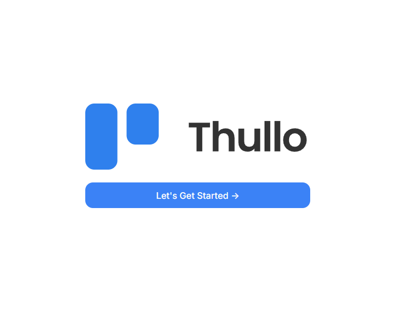

<h1 align="center">Thullo - Trello Clone</h1>

   Solution for a challenge from  <a href="http://devchallenges.io" target="_blank">Devchallenges.io</a>.

  <h3>
    <a href="https://thullo-fawn.vercel.app" target="_blank">
      Demo
    </a>
     | 
    <a href="#" target="_blank">
      Solution
    </a>
     | 
    <a href="https://legacy.devchallenges.io/challenges/wP0LbGgEeKhpFHUpPpDh" target="_blank">
      Challenge
    </a>
  </h3>

<!-- TABLE OF CONTENTS -->

## Table of Contents

- [Overview](#overview)
- [Built With](#built-with)
- [Features](#features)
- [Acknowledgements](#acknowledgements)

<!-- OVERVIEW -->

## Overview

### Built With

<!-- This section should list any major frameworks that you built your project using. Here are a few examples.-->

- **Next.js**
- **Tailwind**
- **Prisma**
- **Zustand**
- **Clerk**
- **uploadthing**

## Features

<!-- List the features of your application or follow the template. Don't share the figma file here :) -->

This application/site was created as a submission to a [DevChallenges](https://devchallenges.io/challenges) challenge. The [challenge](https://devchallenges.io/challenges/wBunSb7FPrIepJZAg0sY) was to build an application to complete the given user stories.

- User story: I can list of available boards
- User story: I can add a new board with a cover photo, title and visibility options
- User story: I can see a board with different columns, team members,... according to the design
- User story: I can add a new list
- User story: I can add a new card to the existing list
- User story: I can set the visibility of the board
- User story: I can add a member to the board (user must exist in the system)
- User story: I can change the name of the board by selecting it
- User story: I can change/add the description of the board
- User story: Given I am an admin, I can remove members from the board
- User story: I can move a card from a column to another one by drag and drop
- User story: When a card is selected, I can rename the title by selecting it
- User story: When a card is selected, I can see which column the card belongs to
- User story: When a card is selected, I can see and change the description
- User story: When a card is selected, I can add new attachments and I can download and delete existing attachments
- User story: When a card is selected, I can add a new comment. Given I am the author, I can edit and delete the comment.
- User story: When a card is selected, I can change the card cover image by searching from Unsplash
- User story: When a card is selected, I can add labels with given colors

---

## Features to be added.

- Board Invites,

## Acknowledgements

- [Vercel](https://vercel.com) - For Deployment
- [Clerk](https://clerk.com) - For Authentication.
- [Unsplash](https://unsplash.com/) - For Image Api.
- [UploadThing](https://uploadthing.com/)- For File upload.
